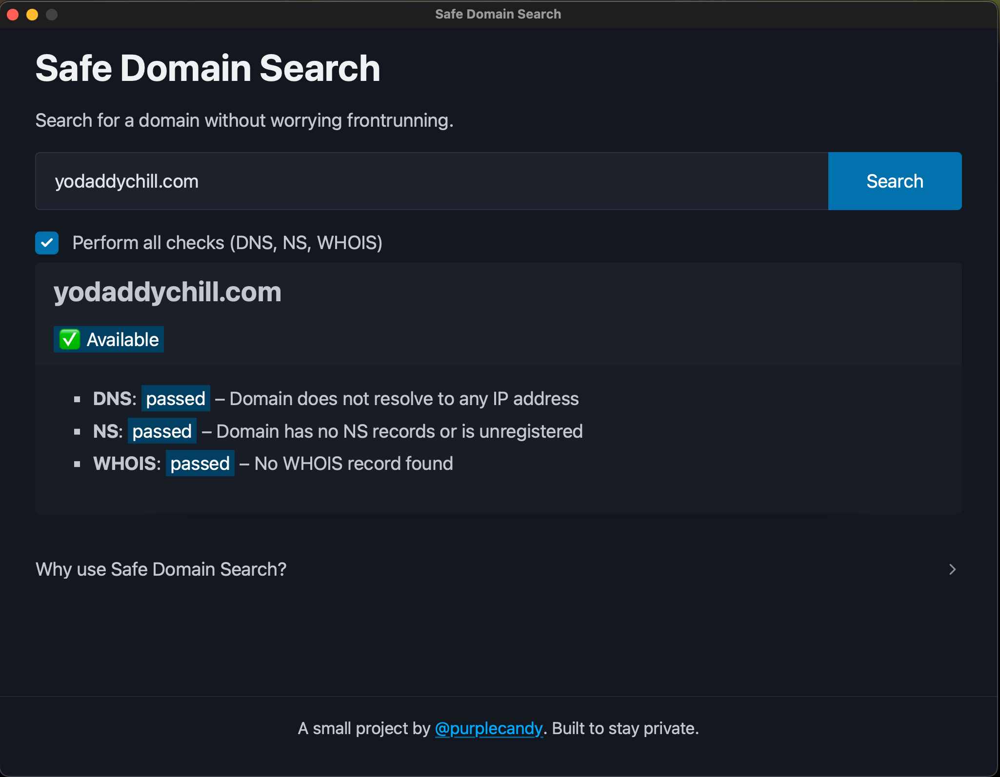

# Safe Domain Search

<p align="center">
  
</p>

Search domain availability **without getting tracked** or frontrun by registrars.

Most online domain search tools silently log your queries and sometimes share them with 3rd parties. This opens the door to a shady practice called **domain front-running** — where someone (often a registrar) sees your search and registers the domain before you can.

Safe Domain Search protects your query by running all checks **locally**, using Go and Wails, with no analytics or telemetry.




[Demo](https://x.com/realpurplecandy/status/1932137314660348017)

## 🔍 What It Does

- Checks if a domain resolves via **DNS**
- Looks for existing **Name Server (NS) records**
- Optionally performs a **WHOIS lookup** for deeper validation
- Returns a structured result with the outcome of each check
- Does **not send your query to third-party services** or tracking tools

## 💡 Why This Matters

> “I checked availability at GoDaddy, and it was free. Hours later, it was listed as a premium domain for $500 — registered the same day by GoDaddy. I waited a week and bought it for the regular fee elsewhere. Never used GoDaddy again.” 
> — _pixelrow on Reddit_

Domain front-running is real, and it's not paranoia — it’s been reported [on Hacker News](https://news.ycombinator.com/item?id=37802959), [on Wikipedia](https://en.wikipedia.org/wiki/Domain_name_front_running), and in domain forums like [NamePros](https://www.namepros.com/threads/how-to-prevent-domain-name-searches-from-being-stolen.1263571/).

## 📦 Install & Run

### Prerequisites

Make sure you have the following installed:

- [Go](https://go.dev/doc/install) (v1.22 or higher)
- [Node.js v22](https://github.com/nvm-sh/nvm) – easiest with **nvm**
- [Wails CLI](https://wails.io/docs/gettingstarted/installation)

---

### Get started

```bash
git clone https://github.com/purplecandy/safe-domain-search
cd safe-domain-search

wails build
```
